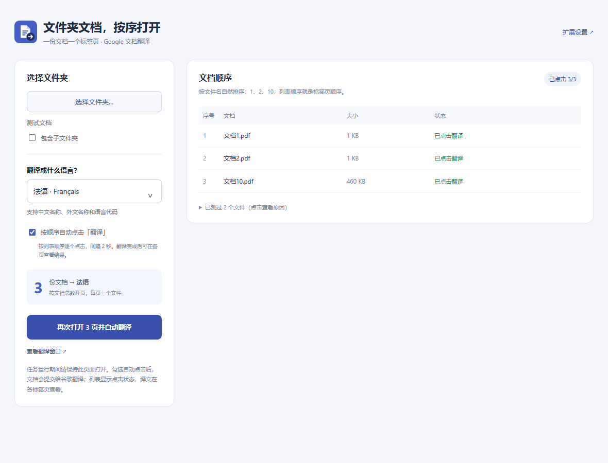

# 谷歌文档翻译 · 无痕多开

Chrome 工具栏扩展，当前版本 **v1.4.0**。从选择语言、批量打开无痕标签页，逐步增加到按文件夹导入文档、依次点击翻译。

## 下载与安装

[下载 v1.4.0 安装包](dist/google-docs-incognito-translator-v1.4.0.zip)，完整解压后，在 `chrome://extensions` 开启开发者模式，加载包含 `manifest.json` 的 `chrome-translate-ten-tabs` 文件夹。

文件夹模式需要在扩展详情中开启「在无痕模式下启用」，并允许访问谷歌翻译网站。

## 功能

- 输入中文、外文名称或代码选择目标语言，内置 64 种语言。
- 普通模式设置 1–100 个标签页，每次创建一个新的无痕窗口。
- 选择文档文件夹，按文件名自然顺序排列，如文档1、文档2、文档10。
- 按实际文档数量开页，每份文档一页；可选包含子文件夹。
- 支持 PDF、DOCX、PPTX、XLSX，单文件上限 10 MB；显示跳过原因。
- 可选按顺序自动点击「翻译」，相邻点击间隔至少 2 秒；支持停止后续点击。
- 显示文档导入和点击状态，防止同一点击指令被重复执行。

自动点击不会等待上一份翻译完成。「已点击翻译」只表示按钮已点击，译文及下载在各个谷歌翻译标签页中查看和操作。运行期间保持文件夹管理页面打开。



## 开发过程与验证

- [开发过程记录](docs/DEVELOPMENT.md)：需求演变、实现选择和问题修复。
- [测试记录](docs/TESTING.md)：20 项单元测试、浏览器功能检查、真实谷歌页面验证。
- [完整安装与使用说明](chrome-translate-ten-tabs/安装与使用.txt)。

本仓库从 v1.4.0 的现有成果开始归档。开发过程文档依据本次协作中的需求和验证记录整理，早期版本没有独立 Git 提交快照。

## 目录

```text
chrome-translate-ten-tabs/       可直接加载的 Chrome 扩展源码
chrome-translate-ten-tabs-dev/   测试脚本、图标构建脚本、验证结果及截图
docs/                           开发过程和测试说明
dist/                           v1.4.0 安装包
```

## 运行测试

单元测试仅使用 Node.js 自带测试工具，无需安装依赖：

```sh
npm test
```

浏览器测试需安装 Playwright，并使用 Windows 中已安装的 Chrome。测试脚本中的 Chrome 路径可以按环境调整，具体命令见[测试记录](docs/TESTING.md)。扩展自身没有 npm 运行时依赖。

## 数据处理

选择的文档在管理页面内存中读取，不写入扩展持久存储。点击翻译后由谷歌翻译处理文档。扩展不需要 API Key，也不使用其他第三方服务器。本仓库仅包含程序和测试用例，不包含用户实际翻译文档。

这是独立的个人工具，并非 Google 官方扩展。
